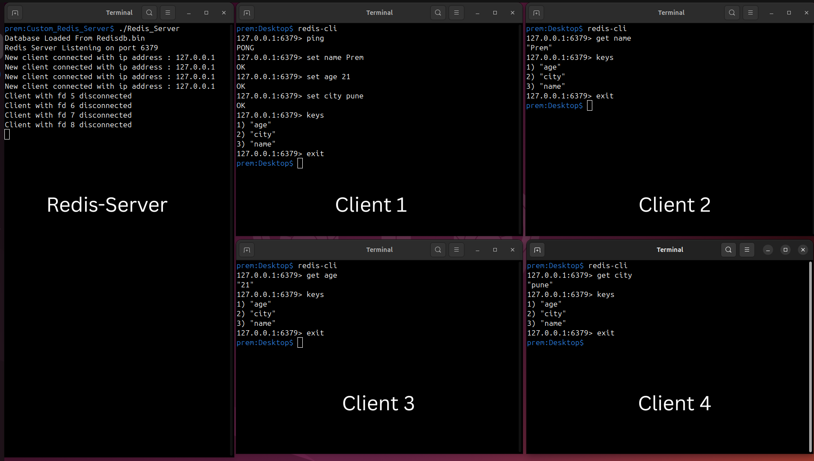

# Custom Redis Server 

## Project Overview

A lightweight Redis-compatible in-memory data store written in C++, inspired by tutorial-based implementation and extended with an epoll-based non-blocking I/O multiplexing architecture instead of multi-threading.

This server supports core Redis string-based commands over TCP using the
**RESP (Redis Serialization Protocol)** and is designed for
high-performance, scalable multi-client handling using the Linux `epoll`
mechanism.

------------------------------------------------------------------------

## Task

A Redis-compatible in-memory key-value store that:

-   Uses **epoll (I/O multiplexing)** for handling multiple clients
-   Supports **RESP parsing**
-   Implements **string-based commands only**
-   Handles **concurrent clients without threads**
-   Supports basic persistence 

------------------------------------------------------------------------

## Screenshots

### Application Screenshot



------------------------------------------------------------------------

## Repository Structure

    CustomRedisServer/
    ├── include/
    │   ├── RedisCmd.h
    │   ├── RedisDatabase.h
    │   ├── RedisParser.h
    │   └── RedisServer.h
    │
    ├── src/
    │   ├── main.cpp
    │   ├── RedisCmd.cpp
    │   ├── RedisDatabase.cpp
    │   ├── RedisParser.cpp
    │   └── RedisServer.cpp
    │
    ├── Redisdb.bin
    ├── Screenshots
    ├── .gitignore
    ├── Makefile
    └── README.md

------------------------------------------------------------------------

## Installation

Ensure you are using a Linux system with GCC.

### Build the Server

``` bash
git clone https://github.com/premc5731/custom-redis-server.git
cd custom-redis-server
make
```

------------------------------------------------------------------------

## Usage

### Run the Server

``` bash
./Redis_Server        # default port 6379
```
#### OR
``` bash
./make run            # default port 6379
```

Server will:

-   Create a non-blocking socket
-   Register it with epoll
-   Enter an infinite event loop
-   Accept and process multiple clients

------------------------------------------------------------------------

## Connecting to the Server

You can connect using:

``` bash
sudo apt install redis-tools
redis-cli 
```

------------------------------------------------------------------------

## Supported Commands

### Common Commands

-   **PING** → `PONG`
-   **ECHO `"message"`**
-   **FLUSHALL**

### Key-Value Commands (Strings Only)

-   **SET `<key>` `<value>`**
-   **GET `<key>`**
-   **DEL `<key>`**
-   **TYPE `<key>`**
-   **KEYS**
-   **RENAME `<old>` `<new>`**

------------------------------------------------------------------------

## Architecture & Design

### Event-Driven Model

Instead of using one thread per client, this server uses:

-   `epoll_create()`
-   `epoll_ctl()`
-   `epoll_wait()`

All client file descriptors are registered with epoll.

### How It Works

1.  Create server socket
2.  Set socket to non-blocking mode
3.  Register server fd in epoll
4.  Wait for events using `epoll_wait()`
5.  If:
    -   Server fd → Accept new connection
    -   Client fd → Read command
6.  Parse RESP
7.  Execute command
8.  Send response

This allows handling thousands of clients efficiently with a single
thread.

------------------------------------------------------------------------

## Concurrency Model Comparison

| Multi-threading          | Epoll (This Project)    |
|--------------------------|------------------------|
| One thread per client    | Single thread          |
| Context switching overhead | No context switching |
| Higher memory usage      | Low memory usage       |
| Blocking model           | Non-blocking I/O       |

------------------------------------------------------------------------

## Learning Outcomes

This project demonstrates understanding of:

-   TCP Socket Programming
-   Non-blocking sockets
-   epoll I/O multiplexing
-   Event-driven architecture
-   RESP protocol
-   Redis internal working principles
-   Linux system calls

------------------------------------------------------------------------

## Author

**Prem Choudhary**\
Linux System Programming \| Redis Internals \| Network Programming
